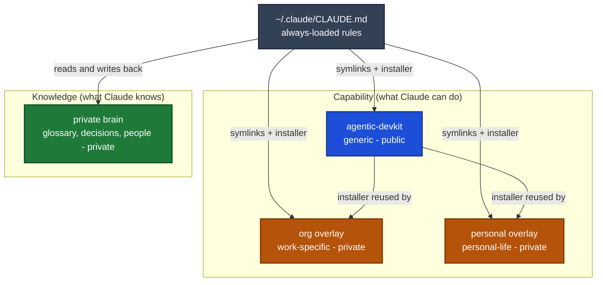
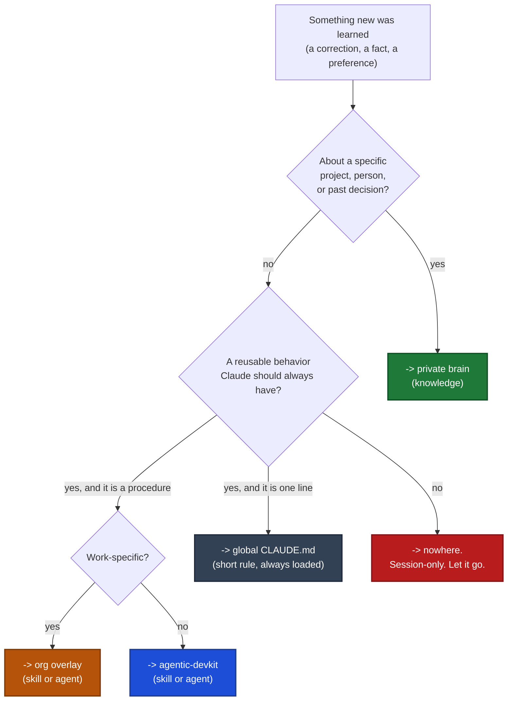

# A managed Claude

This is the one canonical description of how a Claude Code setup is organised when
agentic-devkit manages it. The skills that build and repair that setup
(`a_sk_setup_claude`, `a_sk_tame_claude`, `a_sk_teach_claude`) all defer to this
document instead of restating it.

## Managed vs unmanaged

**Unmanaged** is where most people are. `~/.claude/` fills up over months with hand-written
files: a long `CLAUDE.md` nobody re-reads, skills pasted in from a blog post, agents copied
from another machine, rules that contradict each other. Nothing is in git. Nothing survives a
laptop swap. You cannot tell what is still true.

**Managed** means every file Claude loads is a **symlink into a git repo**. `~/.claude/` holds
pointers only. To change behavior you edit a repo and commit. To set up a new machine you clone
and run one installer. To see what changed you read a diff.

The test: *if this laptop died right now, could a new one be identical in ten minutes?* If yes,
it is managed.

## The four layers

Two different things get managed, and mixing them up is the usual mistake.

- **Capability** is what Claude can *do*: skills, subagents, shell commands. It is code.
- **Knowledge** is what Claude *knows* about you: your projects, your decisions, your people,
  your preferences. It is memory.

Capability is reusable and mostly shareable. Knowledge is specific and almost always private.
They live in different repos.



| Layer | Repo | Visibility | Holds |
|---|---|---|---|
| Rules | `~/.claude/CLAUDE.md` | on the machine | the short, always-loaded rules; points at everything else |
| Core capability | **agentic-devkit** (this repo) | public | generic skills, agents, shell, tools |
| Org capability | your work overlay | private | work-only skills/agents, org profile |
| Personal capability | your personal overlay | private | personal-life skills |
| Knowledge | your **private brain** | private | glossary, decisions, people, conventions, learned corrections |

Only the core is required. Add an overlay when you have something that must not be public. Add
the brain the first time you catch yourself re-explaining the same background to Claude.

### How the overlays work

An overlay is deliberately thin. It does not copy the installer, the shell wiring, or any
generic skill. It has its own `skills/` and `agents/` and an `install.sh` that calls this repo's
`a_c_skills` / `a_c_agents` through `CLAUDE_SKILLS_SRC` / `CLAUDE_AGENTS_SRC`. One installer,
many sources. Install the core first; the overlays fail loudly without it.

### Routing: which repo does a new thing go in?

Most specific wins.

1. Names a work project, service, host, ticket tracker, or internal hostname -> **org overlay**.
2. Personal life or a personal tool, no work content -> **personal overlay**.
3. Everything else -> **agentic-devkit**. This is the default.

If scrubbing the work specifics would leave something useful, put the generic version in the
core and a thin work-specific front in the overlay.

**Guard it.** Put a pre-commit hook on the public repo that greps for your employer's names,
domains, package prefixes, and project code names, and blocks the commit on a hit. A leak into a
public repo is not something you want to discover later.

## The private brain

A git repo of plain Markdown holding facts about your work that no code repo records. Name it
whatever you like: `my_private_brain`, `<name>-brain`, `second-brain`. Keep it **private**.

Suggested layout. Only `CLAUDE.md` and `Glossary/` really matter on day one; grow the rest as
you hit the need.

```
my_private_brain/
├── CLAUDE.md         entry point: which folder answers which question. Read first.
├── Glossary/         short name -> repo -> tracker key; the epics/boards in flight
├── Decisions/        why things are the way they are; trade-offs; rejected options
├── People/           who owns what, who to ping, team boundaries
├── Conventions/      how you want work done (review bar, release habits, naming)
├── Learned/          corrections and gotchas captured from past sessions
└── current_work/     notes on whatever is in flight right now
```

Two rules keep it useful:

- **`CLAUDE.md` is the index.** It tells Claude which folder answers which kind of question, so
  a session does not have to guess or read everything.
- **Facts only, and dated.** Write absolute dates, not "last week". A brain full of stale
  relative time is worse than no brain.

Hook it into the global `CLAUDE.md` with a short section naming the path and telling Claude to
read the brain's `CLAUDE.md` first, and to skip silently if the path is missing (unmounted
volume, different machine). Never let a missing brain block a session.

## The self-learning loop

The setup improves only if what you learn gets written down in the right place. That is one
decision, made every time:



The most important box is the red one. Not everything is worth remembering, and a rules file
that grows every session stops being read. `a_sk_teach_claude` runs this decision for you and
writes the result.

## What the three skills do

| Skill | Use it when |
|---|---|
| `a_sk_setup_claude` | Fresh machine, or a working machine that just needs the devkit wired in |
| `a_sk_tame_claude` | `~/.claude` is a mess: hand-written files, broken links, no git behind it |
| `a_sk_teach_claude` | End of a session where something durable was learned |

## Health rules

- `~/.claude/skills/*` and `~/.claude/agents/*` are **symlinks**. A real file or directory there
  is unmanaged and needs a decision: adopt it into a repo, or delete it.
- **No broken links.** A symlink pointing at a moved or deleted repo silently removes a skill.
  Renaming a repo directory breaks every link into it; re-run the installer with `-f` after any
  rename.
- **Edit the repo, never the link.** Editing through a symlink does write to the repo, but it
  leaves the change uncommitted and easy to lose. Open the repo file.
- **The global `CLAUDE.md` stays short.** It is loaded into every session, so it costs you on
  every request. Long material belongs in a repo doc that gets read on demand, pulled in with an
  `@path` import, or in the brain.
- **One fact, one home.** If the same rule appears in two files they will drift. Keep it in one
  place and link.
